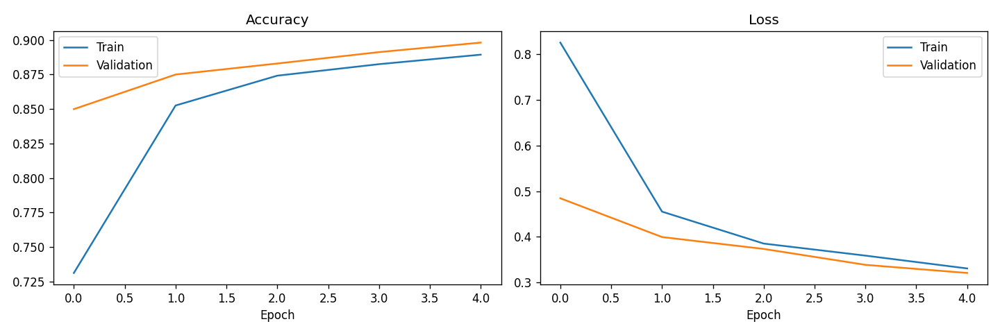
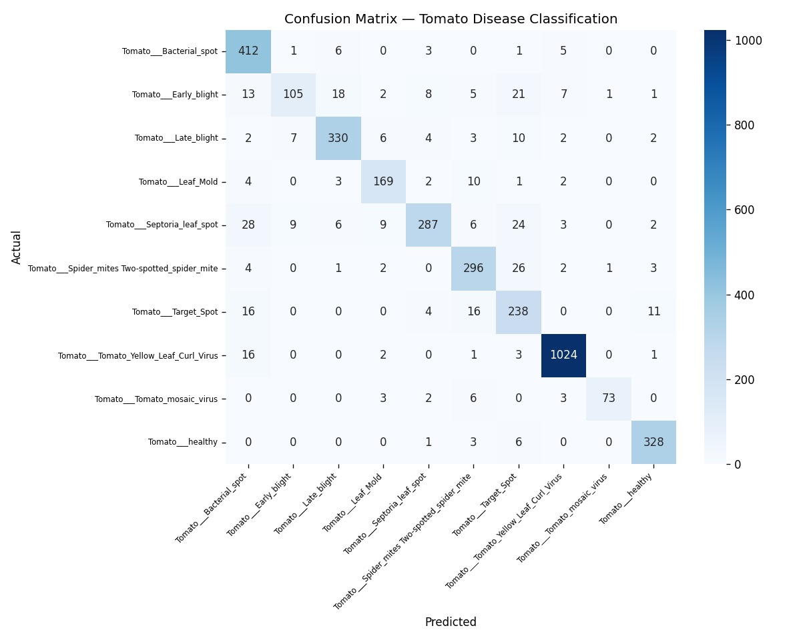

# Tomato Leaf Disease Classification (Transfer Learning)

A deep-learning image classifier that identifies tomato leaf diseases from photographs, built with transfer learning on MobileNetV2. Achieves **~90% validation accuracy** across 10 classes.

## Overview

Plant diseases cause major crop losses, and early visual detection helps farmers act quickly. This project trains an image classifier to distinguish healthy tomato leaves from leaves affected by 9 common diseases, using the [PlantVillage dataset](https://www.kaggle.com/datasets/abdallahalidev/plantvillage-dataset).

Rather than training a neural network from scratch (which needs huge data and compute), the project uses **transfer learning**: a MobileNetV2 model pre-trained on ImageNet is reused as a feature extractor, and a small classifier is trained on top for the tomato classes. This trains in minutes on a free Google Colab GPU.

## Approach

1. **Data** — 10 tomato classes from the PlantVillage dataset (healthy + 9 diseases), loaded directly with `kagglehub`.
2. **Preprocessing** — Images resized to 224x224 and scaled for MobileNetV2; on-the-fly data augmentation (flip, rotation, zoom) to improve generalisation.
3. **Model** — MobileNetV2 (frozen, ImageNet weights) + global average pooling + dropout + dense softmax classifier.
4. **Training** — 80/20 train/validation split, Adam optimiser, 5 epochs.
5. **Evaluation** — Training curves, confusion matrix, and per-class precision/recall/F1 report.

## Results

| Metric | Score |
|---|---|
| Validation accuracy | **89.8%** |
| Classes | 10 (healthy + 9 diseases) |
| Validation images | 3,632 |




The training curves show no overfitting (validation accuracy tracks above training accuracy, validation loss decreases steadily). Most misclassifications occur between visually similar diseases (e.g. Early blight vs. Septoria leaf spot).

Output figures: `sample_images.png`, `training_curves.png`, `confusion_matrix.png`.


## Classes

`Bacterial spot`, `Early blight`, `Late blight`, `Leaf Mold`, `Septoria leaf spot`, `Spider mites (Two-spotted)`, `Target Spot`, `Tomato Yellow Leaf Curl Virus`, `Tomato mosaic virus`, `healthy`

## How to run

The project is designed for Google Colab (free GPU):

1. Open [Google Colab](https://colab.research.google.com).
2. Create a new notebook and paste the cells from `plant_disease_classification.py`.
3. `Runtime -> Change runtime type -> Hardware accelerator: GPU`.
4. Run the cells top to bottom.

Requirements (pre-installed on Colab, except `kagglehub`):

```
tensorflow
kagglehub
scikit-learn
matplotlib
seaborn
numpy
```

## Tech stack

Python, TensorFlow / Keras, MobileNetV2 (transfer learning), scikit-learn, Matplotlib, Seaborn.

## Author

Ilias Bampalis - Chemical Engineering, AUTh
